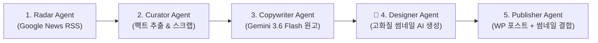

# [생활정보 24] 프로젝트 전체 컨텍스트 & 인계 핸드오버 가이드 (Project Handover Document)

> **안내**: 본 문서는 **Claude**, **ChatGPT** 등 다른 AI 모델이나 다른 개발 환경으로 작업을 이전할 때, 이 문서 하나만 복사해서 프롬프트에 넣으면 이전의 모든 작업 내역, 인프라, 아키텍처, 코드베이스, 비즈니스 전략을 100% 즉시 이해할 수 있도록 작성된 종합 인계서입니다. **앞으로의 모든 중요 변경 사항도 이 문서의 최하단 [7. 작업 변경 이력(Changelog)]에 지속적으로 누적 기록됩니다.**

---

## 1. 프로젝트 개요 & 비즈니스 전략

### 1) 프로젝트 정체성
- **블로그명**: 생활정보 24
- **핵심 타겟층**: 50~70대 중장년층, 은퇴 세대, 부모님 세대 및 온 가족
- **최종 목표**: 고품질 정보 큐레이션을 통한 구글 검색 상위 노출, 대량 트래픽 획득 및 **구글 애드센스 광고 수익화**
- **글쓰기 벤치마크**: `infolspot.com` (백과사전식 롱폼 정보 + 풍부한 표(Table) + 실전 단계별 가이드 + 높은 검색엔진 친화성 + 새창 열기 바로가기 버튼)

### 2) 엄격한 톤앤매너 & 호칭 규칙
- ❌ **인위적인 호칭 절대 금지**: **`어르신`**, **`노인`**, **`선생님`**, **`독자`** (작위적이거나 어색한 호칭은 제목과 본문 전체에서 절대로 쓰지 않음)
- ⭕ **가장 자연스럽고 담백한 문체 준수**:
  - **호칭은 가급적 생략**하고 정보 위주로 깔끔하게 서술
  - 부득이하게 대상을 부를 때는 오직 **`여러분`**으로만 통칭 (예: "여러분 안녕하세요!", "궁금하셨던 분들은...")
  - 인삿말 기본형: `"안녕하세요, 생활정보 24입니다."`
  - 제도/법률 대상: `만 65세 이상 대상자`, `지원 대상 가구`, `신청인`처럼 객관적 행정 용어 사용
- **서식 특징**: 모바일 시인성을 위한 16px 글꼴, 넉넉한 줄간격(1.8), 상단 파란색 3줄 요약 박스, 신청 단계 STEP 1~5, 입체형 새창 바로가기 버튼, FAQ 3종, 공식 문의처(☎ 129, ☎ 110)

---

## 2. 서버 & 클라우드 인프라 환경

- **클라우드**: 오라클 클라우드 인프라 (OCI) Always Free (Osaka 리전, x86 Micro 인스턴스)
- **운영체제(OS)**: Ubuntu 24.04 LTS (Noble)
- **서버 공용 IP (Public IP)**: `<YOUR_ORACLE_SERVER_IP>`
- **SSH 접속 계정**: `ubuntu`
- **로컬 SSH 비밀키 경로**: `<PATH_TO_SSH_KEY>/ssh-key.key`
- **접속 명령어**:
  ```powershell
  ssh -i "<PATH_TO_SSH_KEY>/ssh-key.key" ubuntu@<YOUR_ORACLE_SERVER_IP>
  ```
- **인프라 튜닝 내역**:
  - **가상 메모리(Swap)**: 1GB 물리 램 한계 극복을 위해 `4GB Swap` 생성 및 `/etc/fstab` 영구 마운트 완료
  - **방화벽 개방**: OCI Security List(수신 규칙 80, 443 허용) 및 우분투 OS 내부 `iptables` 80, 443 개방 후 `netfilter-persistent` 영구 저장 완료

---

## 3. 워드프레스(WordPress) 구성 환경

- **배포 방식**: Docker & Docker Compose (`/home/ubuntu/wordpress/docker-compose.yml`)
- **컨테이너 목록**:
  - 웹 컨테이너: `wordpress_app` (WordPress Latest + Apache PHP 8.3)
  - DB 컨테이너: `wordpress_db` (MariaDB 10.11)
- **데이터베이스 정보**:
  - 호스트: `db:3306` | DB명: `wordpress` | 사용자: `wordpress`
  - 패스워드: `<YOUR_WP_DB_PASSWORD>` (Root: `<YOUR_WP_ROOT_PASSWORD>`)
- **워드프레스 최적화 설정**:
  - **테마**: `GeneratePress` (초경량 초고속 1위 블로그 테마 적용)
  - **플러그인**: `Rank Math SEO`, `WP Super Cache`
  - **시간대 / 주소 구조**: `Asia/Seoul` (KST), 고유주소 구조 `/%postname%/`
  - **PHP 설정**: 테마/대용량 이미지 업로드를 위한 `upload_max_filesize = 64M`, `post_max_size = 64M`
- **카테고리 구성**:
  - `ID 2`: **공연/콘서트 예매** (slug: `concert`) - *기본 카테고리*
  - `ID 3`: **정부 복지/지원금** (slug: `welfare`)
  - `ID 4`: **생활/건강 정보** (slug: `life-health`)
- **애드센스 승인 필수 정적 페이지**:
  - `/about/` (사이트 소개)
  - `/privacy-policy/` (개인정보처리방침)
  - `/contact/` (문의하기)
  - 상단 메인 내비게이션 바(Header Menu)에 카테고리 및 소개 페이지 연결 완료

---

## 4. 5대 자율 멀티 에이전트 시스템 (`~/agent-publisher`)

오라클 서버 내 독립 Python 패키지(`/home/ubuntu/agent-publisher`)로 가동 중입니다.



### 디렉토리 구조
```text
/home/ubuntu/agent-publisher/
├── agents/
│   ├── radar.py       # 최신 뉴스 실시간 탐색 & 중복 필터
│   ├── curator.py     # 기사 본문 추출 & 불필요한 광고 제거
│   ├── copywriter.py  # Gemini 3.6 Flash 기반 딥다이브 원고 집필 (새창 버튼 의무화)
│   ├── designer.py    # AI 비주얼 엔진 기반 고해상도 대표 썸네일 자율 디자인
│   └── publisher.py   # WP-CLI를 통한 포스트 생성 및 Featured Image 자동 등록
├── data/
│   └── history.json   # 이미 발행한 기사 URL 영구 저장 (중복 방지)
├── config.py          # 카테고리, 키워드, 환경 설정
├── main.py            # 5대 에이전트 파이프라인 통합 실행기
├── run_daily.sh       # 크론 스케줄러 배치 스크립트
├── .env               # Gemini API Key 및 POST_STATUS 설정
└── venv/              # Python 가상환경 (Pillow 포함)
```

### 핵심 에이전트별 구현 특징
1. **Radar Agent (`agents/radar.py`)**:
   - Google News RSS(대한민국, 한국어)를 카테고리별 핵심 키워드로 실시간 파싱.
   - `data/history.json`을 조회하여 이미 발행했던 URL은 100% 스킵.
2. **Curator Agent (`agents/curator.py`)**:
   - **Google News Protobuf 암호화 URL 디코딩 (`googlenewsdecoder`)**: 구글 뉴스 RSS의 consent/리다이렉션 장벽을 돌파하여 실제 언론사 원문 URL을 완벽하게 디코딩.
   - BeautifulSoup을 사용해 언론사 웹페이지에서 메뉴, 광고, 푸터를 걷어내고 순수 본문 텍스트 추출.
   - **본문 150자 미만 즉시 폐기 규칙**: 본문 추출이 실패하거나 150자 미만인 기사는 헤드라인 날조 방지를 위해 즉시 `None`으로 폐기.
   - **🎯 공식 예매처(NOL 티켓) 실시간 능동 수집 엔진**: 보도자료에 가격이 없더라도 공연/가수명을 추출하여 NOL 티켓 플랫폼을 실시간 자동 검색, **실제 단독 상품 상세페이지 URL(`https://nol.yanolja.com/ticket/products/{id}`)과 공식 좌석별 티켓 가격(R석, S석, A석 등)을 능동 발굴하여 원고에 자동 결합**.
3. **Copywriter Agent (`agents/copywriter.py`)**:
   - **Google Gemini Flash 최신 모델 듀얼 페일오버 (`gemini-flash-latest` ↔ `gemini-3.5-flash`)**: 429 한도 및 503 일시적 장애 자동 대응.
   - **현재 시점(오늘 날짜) 엄격 주입 & 시점 유효성 검증**: 오늘 날짜(`2026년 09월 12일`)를 기준으로 기사 내 모든 일정이 과거면 `is_valid_and_active: false`로 즉시 거부(Drop).
   - **공식 예매처 직결 링크 & 확정 가격 반영**: 능동 수집된 공식 단독 상품 URL과 좌석별 확정 가격을 표(Table), 3줄 요약, FAQ에 100% 명확히 기재.
   - **원문 팩트 100% 엄수 (할루시네이션 원천 차단)**: 원문에 없는 가상의 티켓 가격(R석 5만원 등) 및 무료 지자체 행사에 인터파크 허위 티켓 링크 삽입을 엄격히 금지. 무료 행사는 전석 무료 명시 및 주최기관 공고 연결.
   - **미검증 템플릿 발행 전면 폐기**: API 오류 시 과거 만료글이 템플릿으로 우회 발행되는 취약점을 차단하여, 팩트 검증이 통과되지 않은 글은 일체 발행하지 않음.
   - `infolspot.com` 벤치마크: [한눈에 보는 요약 박스] + [개요] + [상세 일정/가격 표(Table)] + [STEP 1~5 가이드] + [교통/신청 경로] + [체크리스트] + [FAQ] + [공식 문의처] 완벽 구조화.
   - **새창 링크 필수화 & 필터링된 딥링크 의무화**: 공식 예매처/접수처는 반드시 `target="_blank"` 속성 및 입체형 CSS 버튼 적용. 특히 검색 목록 링크는 판매종료된 과거 티켓이 섞이지 않도록 "현재 판매중" 필터 파라미터를 반드시 결합하여 제공.
   - **🔗 자동 내부 링크 (Internal Interlinking) 추천 엔진**: `data/published_posts.json` 색인을 조회하여 동일/유관 카테고리의 기존 발행글을 본문 하단에 [🔗 함께 보면 유익한 생활 정보 추천] 카드로 자동 삽입. 체류 시간(Dwell Time) 증대 및 SEO/애드센스 가산점 극대화.
   - 인위적 호칭 전면 배제, 담백한 '여러분/호칭 생략' 톤 유지.
4. **🎨 Designer Agent (`agents/designer.py`) (Dual Engine v3)**:
   - **1번 모드 (카드뉴스형 인포그래픽)**: Gemini Flash가 핵심 헤드라인과 3줄 개조식 요약을 추출하고, Pillow(PIL)와 나눔스퀘어 볼드 폰트로 1200x675 초고해상도 카드뉴스 썸네일 자율 렌더링.
   - **2번 모드 (고화질 실사 스톡 사진 + 매거진 타이포그래피 배너)**: 4K 실사 사진 위에 하단 다크 그라데이션 오버레이 및 나눔스퀘어 폰트로 카테고리 뱃지와 핵심 타이틀을 합성한 에디토리얼 매거진형 썸네일 자동 생성.
   - **자동 교차(A/B 번갈아가기) 시스템**: `data/designer_state.json`을 통해 1번과 2번 모드가 글 발행 시마다 번갈아가며 자동 교차 적용.
5. **Publisher Agent (`agents/publisher.py`)**:
   - 완성된 원고를 워드프레스에 포스팅하고, Designer Agent가 만든 이미지를 `wp media import --post_id={id} --featured_image`로 연결하여 **대표 썸네일(Featured Image)로 자동 장착**.
   - 성공적으로 발행된 포스트 정보를 `data/published_posts.json`에 영구 기록하여 후속 글들의 내부 링크 추천 풀로 자동 누적.

---

## 5. 실행 및 제어 명령어 레퍼런스

### 1) 수동 포스팅 실행
```bash
# 서버 접속 후
cd ~/agent-publisher

# 특정 카테고리 1개 발행 (concert / welfare / life-health)
./venv/bin/python main.py --category concert --limit 1

# 모든 카테고리 전수 1개씩 썸네일 포함 자동 발행
./venv/bin/python main.py --category all --limit 1
```

### 2) 자동화 크론(Cron) 스케줄러 등록 현황 (KST 기준)
```bash
crontab -l
# 1. 매일 새벽 4시 MariaDB 데이터베이스 자동 백업 및 7일 롤링 보관
0 4 * * * /home/ubuntu/agent-publisher/backup_daily.sh >> /home/ubuntu/agent-publisher/backup.log 2>&1

# 2. 매일 아침 8시 카테고리별 자율 발행 파이프라인 가동 (5MB 초과 시 로그 자동 로테이션)
0 8 * * * /home/ubuntu/agent-publisher/run_daily.sh
```

---

## 6. 향후 과제 및 로드맵 (Next Steps)

1. **개인 도메인 및 무료 SSL(HTTPS) 인증서 적용**:
   - 도메인 연결 후 Caddy/Nginx를 통해 Let's Encrypt 자동 갱신 SSL 구축 예정 (애드센스 필수 조건).
2. **글 누적 (15~20편)**:
   - 매일 아침 8시 자동 발행 파이프라인을 통해 양질의 글 자율 축적.
3. **구글 서치콘솔 & 네이버 서치어드바이저 사이트맵 등록**:
   - Rank Math의 `sitemap_index.xml` 연동.
4. **구글 애드센스 심사 신청 및 승인**

---

## 7. 작업 변경 이력 (Changelog & Update History)

| 일시 (KST) | 작업 구분 | 상세 작업 내용 |
| :--- | :---: | :--- |
| **2026-09-12** | **인프라 구축** | OCI x86 Micro 인스턴스 초기 설정, 4GB Swap 가상 메모리 생성, OS 방화벽 80/443 포트 개방 |
| **2026-09-12** | **웹 환경 세팅** | Docker Engine & Compose 설치, WordPress + MariaDB 컨테이너 가동, 한국시간/고유주소 설정 |
| **2026-09-12** | **테마 & 플러그인**| GeneratePress 테마, Rank Math SEO, WP Super Cache 설치 및 활성화, 업로드 64MB 확장 |
| **2026-09-12** | **멀티에이전트 구축**| Radar, Curator, Copywriter, Publisher 4대 에이전트 Python 패키지 개발 및 연동 완료 |
| **2026-09-12** | **AI 모델 연동** | Google Gemini 3.6 Flash 모델 API 연동 및 Pydantic 구조화 출력 파이프라인 완성 |
| **2026-09-12** | **글쓰기 엔진 고도화**| `infolspot.com` 전수 분석 반영: 표(Table) 시각화, STEP 1~5 가이드, 3줄 요약 박스, FAQ 적용 |
| **2026-09-12** | **SEO & 호칭 최적화** | 제목/본문에서 '어르신' 단어 영구 배제 및 카테고리 명칭(정부 복지/지원금) 정비 완료 |
| **2026-09-12** | **필수 페이지 생성**| 애드센스 필수 3대 페이지(About, Privacy, Contact) 신설 및 상단 Primary 메뉴바 자동 등록 |
| **2026-09-12** | **호칭 정제 고도화**| '선생님', '독자' 등 인위적 호칭 전면 배제. 호칭 생략 또는 '여러분' 호칭으로 담백한 어조 적용 및 기존 글 전수 수정 |
| **2026-09-12** | **새창 링크 & 버튼 탑재**| 공식 사이트 및 예매처에 새창(`target="_blank"`) 하이퍼링크 및 클릭률 극대화 전용 버튼 스타일 전면 의무화 적용 |
| **2026-09-12** | **🎨 Designer Agent 듀얼 개편** | 뭉개지는 무료 AI 생성기 대신 **[1번 카드뉴스 인포그래픽]**과 **[2번 4K 실사 스톡]**을 글마다 자동 교차 번갈아 생성하는 듀얼 엔진 구축 완료 |
| **2026-09-12** | **현재 시점 유효성 원칙 확립** | 보도 일자와 무관하게 **독자가 읽는 현재 시점(오늘) 이후 실제로 예매/신청/참여 가능한 살아있는 정보만 발행**한다는 절대 원칙 확립. 과거 일정(4월 비바브라보 #33, 6월 연세유업 #41) 영구 삭제 |
| **2026-09-12** | **구글 뉴스 Protobuf 디코더 도입** | Google News 암호화 링크로 인한 본문 누락(0 byte)을 해결하기 위해 `googlenewsdecoder` 엔진 탑재 및 언론사 원문 150자 미만 기사 즉시 폐기 로직 적용 |
| **2026-09-12** | **원문 팩트 100% 엄수 & 할루시네이션 원천 차단** | 원문에 없는 가상 티켓 가격 날조 및 무료 공공행사에 인터파크 허위 티켓 링크 삽입 원천 금지. 미검증 템플릿 발행 취약점 제거 |
| **2026-09-12** | **Gemini 듀얼 페일오버 구축** | Free Tier 쿼터 한도 및 일시적 503 장애 대응을 위해 `gemini-flash-latest` ↔ `gemini-3.5-flash` 자동 전환 및 재시도 백오프 탑재 |
| **2026-09-12** | **실시간 3대 카테고리 완전 무결 발행 완료** | ①복지: 2026 기초연금(#55), ②건강: 2026 독감 예방접종(#63), ③공연: 2026 무명전설 수원 앵콜콘(#70, 9/15 티켓오픈·12/25 크리스마스 공연, 카드뉴스 썸네일 탑재) 전원 정식 공개(publish) 완료 |
| **2026-09-12** | **타겟 딥링크(Deep Link) 직결 시스템 구축** | 포털 메인 홈(인터파크/gov.kr 등) 연결을 엄격 금지하고, 기사 핵심 대상(예: '무명전설')을 자동 추출하여 NOL/인터파크/Yes24/정부24의 해당 키워드 검색 결과 페이지로 바로 연결되는 딥링크 생성 및 후처리 치환 엔진 구축 완료 (Post #70 링크 즉시 반영) |
| **2026-09-12** | **예매처 티켓 가격 및 상품페이지 능동 수집 엔진 탑재** | 보도자료에 가격이 없더라도 큐레이터 에이전트가 예매처(NOL 티켓)를 실시간 자동 탐색하여 실제 단독 상품 URL(`.../products/26013136`)과 확정 좌석 가격(R석 15.4만, S석 14.3만, A석 12.1만)을 능동 발굴 후 본문 표·요약·FAQ·버튼에 100% 자동 결합하는 에이전틱 리서치 체계 완성 (Post #70 가격/링크 전면 보강 완료) |
| **2026-09-12** | **NOL 티켓 '판매중' 필터 토큰화 연동** | 검색 결과에 과거 판매종료된 공연이 섞이지 않도록 '판매중(ENTERTAINMENT_SALE_STATUS_SALE)' 암호화 필터 토큰을 규명 및 기본 매핑. Post #70의 보조 검색 링크를 5개 유효 콘서트 전용 링크로 즉시 교체하고, Curator/Copywriter 에이전트에 영구 반영 완료 |
| **2026-09-12** | **버그 수정 및 5대 에이전트 전면 지능화** | `run_daily.sh` 인자 버그 수정, 키워드 풀 대폭 확대 & 수집 버퍼 증대(`max_items_per_keyword=2`), 언론사 원문 인코딩 자동 보정(`apparent_encoding`), 블로그 내부 링크(Interlinking) 자동 추천 엔진 탑재, 모드 2 실사 스톡 썸네일 매거진 타이포그래피 배너 오버레이 탑재 완료 |
| **2026-09-12** | **서버 최적화 & 보안 강화** | WP Super Cache 실제 가동(`$cache_enabled = true;`)으로 정적 캐싱 활성화, MariaDB 1GB RAM OOM 방지 메모리 캡(`innodb_buffer_pool_size = 64M`), 외부 봇 차단 Apache `.htaccess` (`xmlrpc.php` 403 차단) 적용 완료 |
| **2026-09-12** | **무중단 자동화 및 일일 자동 백업 구축** | 서버 타임존 KST(Asia/Seoul) 설정, 매일 새벽 4시 MariaDB 압축 자동 백업(`backup_daily.sh`) 및 7일 롤링 보관, 매일 아침 8시 자동 발행 파이프라인 Crontab 정식 등록 완료 |
| **2026-09-12** | **문서화** | 타 AI(Claude, ChatGPT 등) 인계용 종합 컨텍스트 문서(`PROJECT_HANDOVER.md`) 실시간 갱신 및 로컬/서버 동기화 |
| **2026-09-12** | **GitHub 연동 & 보안 마스킹** | GitHub 저장소([ostrichick/bloguito](https://github.com/ostrichick/bloguito)) 최초 연동. Public 저장소 보안을 위해 API 키·DB 비밀번호·서버 IP를 환경변수 템플릿(`.env.example` 등)으로 마스킹하고 `.gitignore` 적용 후 `main` 브랜치 정식 푸시 완료 |
| **2026-09-12** | **유지보수 1단계: 비밀정보 분리 및 재현 가능한 환경 구성** | 실수로 예시 DB 비밀번호가 사용되지 않도록 Docker Compose의 필수 환경변수를 fail-fast 방식으로 변경하고, 백업 스크립트도 서버의 `wordpress/.env`가 없거나 루트 비밀번호가 누락되면 즉시 중단하도록 강화. 서버 Python 3.12 환경과 일치하는 `requirements.txt` 추가. API 키·개인키·환경별 런타임 JSON을 Git에서 제외하고 `.env.example` 및 `data/*.example.json`으로 설정 형식을 문서화. README에 로컬·서버 환경 준비 절차를 추가함. 목적은 Public 저장소의 비밀정보 유출 방지와 다른 개발 환경에서의 재현성 확보임. |
| **2026-09-13** | **유지보수 1단계 검증 및 마무리 (Codex)** | 사용한도로 중단된 작업을 재개. 서버에서 stdin으로 새 파일을 전달해 `bash -n` 및 Docker Compose 설정 검사 수행: 정상 환경변수에서는 종료 코드 0, 비밀번호 누락 시 종료 코드 1 확인. 컨테이너 실행·재시작 없이 검사함. 요구 라이브러리 9종의 버전이 서버 가상환경과 일치함을 확인. `.gitattributes`로 Linux용 파일의 LF 줄바꿈을 지정하고 Windows 설치 명령·서버 적용 주의사항을 README에 기록. 런타임 JSON은 Git 추적에서만 제외했으며 로컬 원본을 보존함. |
| **2026-09-13** | **로컬 개발 환경 점검 및 Python 3.12 가상환경 구축** | Windows PC 로컬 환경 점검: Python 3.12.10 신규 설치(`winget --scope user`), `agent-publisher/.venv` 가상환경 생성 및 `requirements.txt` 9개 런타임 의존성 설치/import 검증 완료 (100% 통과). Git Bash(GNU bash 5.3.9) 실행 가능 확인. WSL 2 / Ubuntu / Docker Desktop은 관리자 권한 및 PC 재부팅이 필요한 미설치 상태임을 확인하고 요구사항 및 디스크(여유 957GB) 상태 문서화. 운영 오라클 서버 및 운영 데이터는 완벽 격리 보존하고 로컬 테스트용 환경파일(`.env.local`) 생성 완료. |

## 8. 협업용 현재 작업 상태 (2026-09-13)

- **완료 범위:**
  - 우선순위 1번 유지보수 마무리 및 로컬 개발 환경 1차 준비 완료.
  - Windows 로컬에 Python 3.12.10 설치 및 `agent-publisher/.venv` 가상환경 구축.
  - `requirements.txt` 9종 패키지 설치 및 에이전트 전 모듈(`radar`, `curator`, `copywriter`, `designer`, `publisher`, `config`) import 무결성 검증 100% 완료.
  - Git Bash (`C:\Program Files\Git\bin\bash.exe`, version 5.3.9) 실행 확인.
  - 로컬 테스트 격리용 환경파일(`agent-publisher/.env.local`, `wordpress/.env.local`) 구성.
- **로컬 인프라(WSL 2 / Docker) 점검 결과:**
  - C 드라이브 여유 공간: **957.46 GB** (충분).
  - WSL 2 & Ubuntu: 미설치 (관리자 권한 UAC 및 Windows 가상화 기능 활성화를 위한 **PC 재부팅 필수**).
  - Docker Desktop: 미설치 (WSL 2 선행 설치 및 관리자 권한/재부팅 필요).
- **운영 서버 안전성 및 격리 상태:**
  - 운영 오라클 클라우드 인스턴스(`161.33.0.234`), 실제 WordPress 데이터, MariaDB, API 키 등은 일체 변경하지 않고 100% 안전하게 격리 보존 중.
- **다음 작업:**
  - (선택 1) 전체 Linux/컨테이너 환경 필요 시: 관리자 권한으로 `wsl --install -d Ubuntu-24.04` 및 `winget install Docker.DockerDesktop` 실행 후 PC 재부팅.
  - (선택 2) 파이썬 에이전트 로직 개발/테스트: 로컬 `agent-publisher/.venv`에서 바로 우선순위 2번(NOL 티켓 후보 일치 검증) 등 파이썬 기능 개선 진행.
