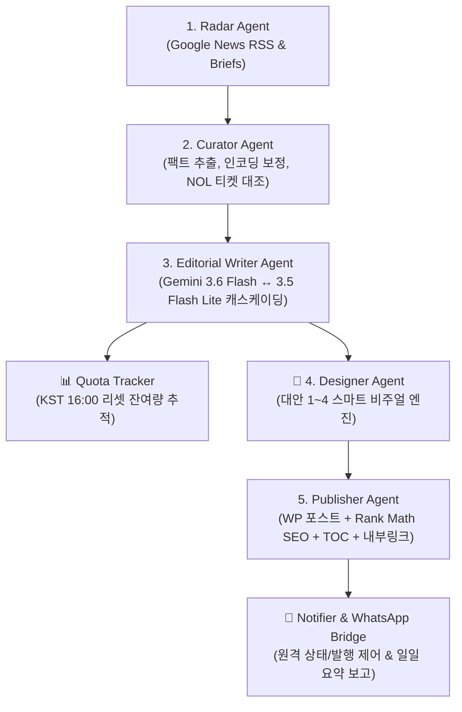

# [생활정보 24] 프로젝트 전체 컨텍스트 & 인계 핸드오버 가이드 (Project Handover Document)

> **현행 검증 결과 (2026-09-20):** 아래 과거 작업 이력의 “100% 검증”, “발행 완료”, “고단가”, “SEO 극대화” 등은 당시 작업자 기록이며 검색성과·사실 정확성의 실측 보증이 아닙니다. 운영 공개 글 12편과 개인정보처리방침 1편을 실제 수정·재조회했습니다. 로컬 단위·회귀 테스트 137개 통과, 통합 백업 생성과 3개 구성요소 SHA256 검증 완료(실제 운영 DB 복구는 시행하지 않음). 현행 사실관계 및 남은 과제는 [2026-09-20 감사·수정 기록](docs/audit-remediation-2026-09-20.md)을 우선 참조합니다.


> **안내**: 본 문서는 **Claude**, **ChatGPT** 등 다른 AI 모델이나 다른 개발 환경으로 작업을 이전할 때, 이 문서 하나만 복사해서 프롬프트에 넣으면 이전의 모든 작업 내역, 인프라, 아키텍처, 코드베이스, 비즈니스 전략을 100% 즉시 이해할 수 있도록 작성된 종합 인계서입니다. **앞으로의 모든 중요 변경 사항도 이 문서의 최하단 [7. 작업 변경 이력(Changelog)]에 지속적으로 누적 기록됩니다.**

---

## 1. 프로젝트 개요 & 비즈니스 전략

### 1) 프로젝트 정체성
- **블로그명**: 생활정보 24
- **핵심 타겟층**: 50~70대 중장년층, 은퇴 세대, 부모님 세대 및 온 가족
- **최종 목표**: 고품질 정보 큐레이션을 통한 구글 검색 상위 노출, 대량 트래픽 획득 및 **구글 애드센스 광고 수익화**
- **글쓰기 벤치마크**: `infolspot.com` (백과사전식 롱폼 정보 + 풍부한 표(Table) + 실전 단계별 가이드 + 높은 검색엔진 친화성 + 새창 열기 바로가기 버튼)

### 2) 엄격한 톤앤매너 & 호칭 규칙
- ❌ **인위적인 호칭 절대 금지**: **`어르신`**, **`노인`**, **`선생님`**, **`독자`** (작위적이거나 어색한 호칭은 제목과 본문 전체에서 절대로 쓰지 않음)
- ⭕ **가장 자연스럽고 담백한 문체 준수**:
  - **호칭은 가급적 생략**하고 정보 위주로 깔끔하게 서술
  - 부득이하게 대상을 부를 때는 오직 **`여러분`**으로만 통칭 (예: "여러분 안녕하세요!", "궁금하셨던 분들은...")
  - 인삿말 기본형: `"안녕하세요, 생활정보 24입니다."`
  - 제도/법률 대상: `만 65세 이상 대상자`, `지원 대상 가구`, `신청인`처럼 객관적 행정 용어 사용
- **서식 특징**: 모바일 시인성을 위한 16px 글꼴, 넉넉한 줄간격(1.8), 상단 파란색 3줄 요약 박스, 신청 단계 STEP 1~5, 입체형 새창 바로가기 버튼, FAQ 3종, 공식 문의처(☎ 129, ☎ 110)

---

## 2. 서버 & 클라우드 인프라 환경

- **클라우드**: 오라클 클라우드 인프라 (OCI) Always Free (Osaka 리전, x86 Micro 인스턴스)
- **운영체제(OS)**: Ubuntu 24.04 LTS (Noble)
- **서버 공용 IP (Public IP)**: `<YOUR_ORACLE_SERVER_IP>`
- **SSH 접속 계정**: `ubuntu`
- **로컬 SSH 비밀키 경로**: `<PATH_TO_SSH_KEY>/ssh-key.key`
- **접속 명령어**:
  ```powershell
  ssh bloguito  # 사용자 ~/.ssh/config에 기존 개인키 지정, 2026-09-20 무인 인증 성공
  ```
- **인프라 튜닝 내역**:
  - **가상 메모리(Swap)**: 1GB 물리 램 한계 극복을 위해 `4GB Swap` 생성 및 `/etc/fstab` 영구 마운트 완료
  - **방화벽 개방**: OCI Security List(수신 규칙 80, 443 허용) 및 우분투 OS 내부 `iptables` 80, 443 개방 후 `netfilter-persistent` 영구 저장 완료

---

## 3. 워드프레스(WordPress) 구성 환경

- **배포 방식**: Docker & Docker Compose (`/home/ubuntu/wordpress/docker-compose.yml`)
- **컨테이너 목록**:
  - 웹 컨테이너: `wordpress_app` (WordPress Latest + Apache PHP 8.3)
  - DB 컨테이너: `wordpress_db` (MariaDB 10.11)
- **운영 도메인 및 접속 정보**:
  - **공식 사이트 주소**: `https://lifeinfo24.org` (Let's Encrypt 와일드카드 SSL 인증서 적용, Host Nginx 리버스 프록시)
  - **관리자 페이지**: `https://lifeinfo24.org/wp-admin/`
- **데이터베이스 정보**:
  - 호스트: `db:3306` | DB명: `wordpress` | 사용자: `wordpress`
  - 패스워드: `<YOUR_WP_DB_PASSWORD>` (Root: `<YOUR_WP_ROOT_PASSWORD>`)
- **워드프레스 최적화 설정**:
  - **테마**: `GeneratePress` (초경량 초고속 1위 블로그 테마 적용, 커스텀 E-E-A-T 푸터 및 작성자 메타 제거)
  - **플러그인**: `Rank Math SEO`, `WP Super Cache` (정적 HTML 캐싱 가동), `WP Statistics` (v14.16, 관리자 제외 및 봇 필터링 완료)
  - **시간대 / 주소 구조**: `Asia/Seoul` (KST), 고유주소 구조 `/%postname%/`
  - **PHP 설정**: 테마/대용량 이미지 업로드를 위한 `upload_max_filesize = 64M`, `post_max_size = 64M`
- **카테고리 구성 (4대 핵심 카테고리)**:
  - `ID 2`: **공연/콘서트 예매** (slug: `concert`) - *기본 카테고리*
  - `ID 3`: **정부 복지/지원금** (slug: `welfare`)
  - `ID 4`: **생활/건강 정보** (slug: `life-health`)
  - `ID 102`: **생활 세금/절세 정보** (slug: `tax`) - *고단가 High-CPC 타깃 신설*
- **마스터 대표 콘텐츠 (Pillar Content)**:
  - **포스트 #101**: `2026년 기초연금 수급자격 및 소득인정액 모의계산 완벽 가이드` (4,200자급, 홈 상단 `Sticky Post` 고정)
  - **포스트 #139**: `2026 잠자는 정부 환급금 5종 통합 조회 및 비대면 신청 총정리` (4,000자급 대백과형 가이드)
- **애드센스 승인 필수 정적 페이지**:
  - `/about/` (사이트 소개)
  - `/privacy-policy/` (개인정보처리방침)
  - `/contact/` (문의하기)
  - 상단 메인 내비게이션 바(Header Menu)에 카테고리 및 소개 페이지 연결 완료

---

## 4. 자율 멀티 에이전트 & 에디토리얼 시스템 (`~/agent-publisher`)

오라클 서버 내 독립 Python 패키지(`/home/ubuntu/agent-publisher`)로 가동 중입니다.



### 디렉토리 구조
```text
/home/ubuntu/agent-publisher/
├── agents/
│   ├── radar.py            # 최신 뉴스 실시간 탐색 & 중복 필터
│   ├── curator.py          # 기사 본문 추출, 인코딩 자동 보정 & NOL 티켓 능동 발굴
│   ├── copywriter.py       # (레거시/폴백) 원고 집필 에이전트
│   ├── editorial.py        # 에디토리얼 렌더러 (TOC, 3초 요약 카드, STEP 앵커, 내부링크)
│   ├── editorial_writer.py # 지능형 모델 캐스케이딩 기반 에디토리얼 원고 집필기
│   ├── designer.py         # 대안 1~4 스마트 라우팅 멀티 비주얼 엔진
│   ├── publisher.py        # WP-CLI, Rank Math SEO 메타 주입, 대표 썸네일 등록
│   └── quota_tracker.py    # KST 16:00 기준 Gemini 일일 모델별 호출 한도 추적기
├── whatsapp-bridge/        # @whiskeysockets/baileys 기반 왓츠앱 원격 제어 비서 (66MB 점유)
├── data/
│   ├── history.json        # 이미 발행한 기사 URL 영구 저장 (중복 방지)
│   ├── published_posts.json# 발행된 글 색인 (내부 링크 추천 풀)
│   ├── draft_posts.json    # 임시글 색인
│   ├── quota_usage.json    # 실시간 API 사용량 및 잔여 할당량 데이터
│   └── search_briefs.json  # 고단가 High-CPC 키워드 브리프 풀
├── editorial_cli.py        # 원고 검토, 임시글 조회(`list-drafts`), 승격(`promote-draft`) CLI
├── notifier.py             # 텔레그램/디스코드/왓츠앱 일일 요약 알림 모듈
├── editorial_policy.json   # 공통 편집 정책 및 검증 임계값 설정
├── config.py               # 4대 카테고리, 키워드, 환경 설정 일원화
├── main.py                 # 멀티 에이전트 파이프라인 통합 실행기
├── run_daily.sh            # 크론 스케줄러 배치 스크립트 (로그 자동 로테이션)
├── backup_daily.sh         # DB+업로드+설정 3대 핵심 자산 일일 통합 압축 백업기
├── restore_backup.sh       # SHA256 사전 검증 기반 원클릭 복구 도구
├── .env                    # Gemini API Key, POST_STATUS, 사이트 설정
└── venv/                   # Python 3.12 가상환경
```

### 핵심 에이전트 및 컴포넌트별 구현 특징
1. **Radar Agent (`agents/radar.py`)**:
   - Google News RSS(대한민국, 한국어) 및 사전 승인된 고단가 검색 브리프(`data/search_briefs.json`) 실시간 파싱.
   - `data/history.json`을 조회하여 이미 발행했던 URL은 100% 스킵.
2. **Curator Agent (`agents/curator.py`)**:
   - **Google News Protobuf 암호화 URL 디코딩 (`googlenewsdecoder`)**: 언론사 원문 URL을 완벽하게 디코딩.
   - BeautifulSoup을 사용해 메뉴, 광고를 제거하고 순수 본문 추출. EUC-KR/CP949 한글 깨짐 자동 방지(`apparent_encoding`).
   - **본문 150자 미만 즉시 폐기 규칙**: 헤드라인 날조 방지.
   - **NOL 티켓 능동 대조**: 공연/가수명을 추출하여 NOL 단독 상품 상세 URL 및 공식 좌석별 티켓 가격 능동 발굴 결합.
3. **Editorial Writer Agent (`agents/editorial_writer.py`) & Quota Tracker**:
   - **지능형 모델 캐스케이딩**:
     - **실제 기본 선호**: `editorial_policy.json`의 `gemini-3.5-flash`. `EDITORIAL_WRITER_MODEL`·`EDITORIAL_REVIEWER_MODEL` 환경변수로 덮어쓰기 가능. 아래 수치는 로컬 가정이며 실제 API 제한을 조회하지 않음
     - **실제 폴백 순서**: 선호 모델 → `gemini-3.6-flash` → `gemini-3.5-flash-lite`; 429/503에 다음 모델로 전환. 로컬 설정 한도 20/500은 제공자 실시간 할당량이 아님
     - 429 한도 또는 503 혼잡 시 즉각 백업 모델로 자동 전환하여 글 생성을 중단 없이 완수.
   - **일일 할당량 추적기 (`agents/quota_tracker.py`)**: Google AI Studio 일일 리셋 시점(KST 16:00)을 기준으로 모델별 잔여량을 `data/quota_usage.json`에 정밀 기록.
   - **공통 편집 규약 (`docs/EDITORIAL_SYSTEM.md`) 100% 준수**:
     - 독자가 3초 안에 핵심을 파악할 수 있는 **[3초 핵심요약 카드]** 두괄식 배치.
     - 메뉴 이동 경로를 명시한 **[STEP 1~5 실행 절차]** 및 점프 링크 앵커(`id="step-N"`).
     - 원문 근거가 명확한 수치만 보존하고 계산/날조/인위적 호칭('어르신', '독자' 등) 엄격 배제.
     - 공식 출처 기관 검증 배지 및 Q&A 카드형 FAQ 구성.
4. **🎨 Designer Agent (`agents/designer.py`) (4대 멀티 비주얼 엔진)**:
   - 주제와 카테고리에 따라 **[대안 1: 클린 공식 포스터]**, **[대안 2: 토스풍 모바일 타이포 카드]**, **[대안 3: 키워드 매칭 실사스톡]**, **[대안 4: 하이브리드 포스터+브랜드 프레임]**을 지능적 자율 라우팅.
   - 외부 이미지 실패 시 대안 2(토스풍 타이포 카드)로 안전 폴백(Fallback).
5. **Publisher Agent (`agents/publisher.py`)**:
   - KST aware ISO 타임존 포맷 적용, 대표 썸네일 자동 등록.
   - **Rank Math SEO 메타 자동 주입**: 포커스 키워드(`rank_math_focus_keyword`), 설명(`rank_math_description`) 자동 설정.
   - **TOC & 내부 링크(Interlinking)**: 경량 목차 자동 생성 및 `published_posts.json` 기반 하단 추천 카드 결합.
6. **WhatsApp 원격 제어 비서 (`agent-publisher/whatsapp-bridge/`)**:
   - `@whiskeysockets/baileys` 웹소켓 기반 스마트폰 원격 제어 데몬 (`whatsapp-bridge.service`).
   - 명령어: `/status`(서버 상태), `/list`(임시글 목록), `/publish <ID>`(즉시 정식 발행), `/backup`(즉시 DB 백업), `/quota`(실시간 사용량이 아닌 로컬 추정치), `/help`.

---

## 5. 실행 및 제어 명령어 레퍼런스

### 1) 수동 포스팅 및 초안 관리 CLI
```bash
# 서버 접속 후
cd ~/agent-publisher

# 특정 카테고리 임시글 1개 생성 (concert / welfare / life-health / tax)
./venv/bin/python main.py --category tax --limit 1

# 모든 카테고리별 검토 후 임시글 1개씩 생성 (자동 공개 아님)
./venv/bin/python main.py --category all --limit 1

# 워드프레스 내 대기 중인 임시글(Draft) 목록 열람
./venv/bin/python editorial_cli.py list-drafts

# 개별 콘텐츠를 사람이 검토한 뒤에만 실행; 최신 공식 원문이 변경되었거나 레거시 초안이면 거부
./venv/bin/python editorial_cli.py promote-draft <REVIEWED_DRAFT_ID> --confirm-publish
```

### 2) WhatsApp 원격 제어 명령어 (스마트폰 메신저)
* `/status` (또는 `상태`): 서버 메모리, 디스크, Uptime, 도메인 연결 상태 확인
* `/list` (또는 `초안`, `목록`): 현재 발행 대기 중인 임시글 목록 열람
* `/publish <ID>` (또는 `/발행 <ID>`): 작성 근거·검토 시점·초안 내용이 모두 유효할 때만 사용자 명령으로 공개
* `/quota` (또는 `사용량`): 로컬 가정 한도를 이용한 추정 호출량 표시. 실제 API 잔여 할당량 아님
* `/backup` (또는 `백업`): DB·미디어·설정 통합 백업 트리거

### 3) 자동화 크론(Cron) 스케줄러 등록 현황 (KST 기준)
```bash
crontab -l
# 1. 매일 새벽 4시 DB+업로드+설정 통합 스냅샷 자동 백업 및 7일 롤링 보관
0 4 * * * /home/ubuntu/agent-publisher/backup_daily.sh >> /home/ubuntu/agent-publisher/backup.log 2>&1

# 2. 매일 아침 8시 카테고리별 자율 발행 파이프라인 가동 (5MB 초과 시 로그 자동 로테이션)
0 8 * * * /home/ubuntu/agent-publisher/run_daily.sh
```

### 4) 수동 백업 및 원클릭 복구(Restore) 명령어
```bash
# 1. 수동 통합 백업 실행 (db.sql.gz + uploads.tar.gz + configs.tar.gz + manifest.json)
./agent-publisher/backup_daily.sh

# 2. 원클릭 복구 실행 (SHA256 체크섬 사전 검증 후 대화형 복구)
./agent-publisher/restore_backup.sh /home/ubuntu/backups/bloguito_backup_20260913_040001.tar.gz

# 3. 로컬 PC로 원격 오라클 백업 파일 동기화 (Windows PowerShell)
python scripts/sync_backups.py
```

# 3. 비대화형 자동 승인 복구
./agent-publisher/restore_backup.sh /home/ubuntu/backups/bloguito_backup_20260913_040001.tar.gz --yes
```

---

## 6. 향후 과제 및 로드맵 (Next Steps)

1. **개인 도메인 및 무료 SSL(HTTPS) 인증서 적용**:
   - 도메인 연결 후 Caddy/Nginx를 통해 Let's Encrypt 자동 갱신 SSL 구축 예정 (애드센스 필수 조건).
2. **글 누적 (15~20편)**:
   - 매일 아침 8시 자동 발행 파이프라인을 통해 양질의 글 자율 축적.
3. **구글 서치콘솔 & 네이버 서치어드바이저 사이트맵 등록**:
   - Rank Math의 `sitemap_index.xml` 연동.
4. **구글 애드센스 심사 신청 및 승인**

---

## 7. 작업 변경 이력 (Changelog & Update History)

| 일시 (KST) | 작업 구분 | 상세 작업 내용 |
| :--- | :---: | :--- |
| **2026-09-12** | **인프라 구축** | OCI x86 Micro 인스턴스 초기 설정, 4GB Swap 가상 메모리 생성, OS 방화벽 80/443 포트 개방 |
| **2026-09-12** | **웹 환경 세팅** | Docker Engine & Compose 설치, WordPress + MariaDB 컨테이너 가동, 한국시간/고유주소 설정 |
| **2026-09-12** | **테마 & 플러그인**| GeneratePress 테마, Rank Math SEO, WP Super Cache 설치 및 활성화, 업로드 64MB 확장 |
| **2026-09-12** | **멀티에이전트 구축**| Radar, Curator, Copywriter, Publisher 4대 에이전트 Python 패키지 개발 및 연동 완료 |
| **2026-09-12** | **AI 모델 연동** | Google Gemini 3.6 Flash 모델 API 연동 및 Pydantic 구조화 출력 파이프라인 완성 |
| **2026-09-12** | **글쓰기 엔진 고도화**| `infolspot.com` 전수 분석 반영: 표(Table) 시각화, STEP 1~5 가이드, 3줄 요약 박스, FAQ 적용 |
| **2026-09-12** | **SEO & 호칭 최적화** | 제목/본문에서 '어르신' 단어 영구 배제 및 카테고리 명칭(정부 복지/지원금) 정비 완료 |
| **2026-09-12** | **필수 페이지 생성**| 애드센스 필수 3대 페이지(About, Privacy, Contact) 신설 및 상단 Primary 메뉴바 자동 등록 |
| **2026-09-12** | **호칭 정제 고도화**| '선생님', '독자' 등 인위적 호칭 전면 배제. 호칭 생략 또는 '여러분' 호칭으로 담백한 어조 적용 및 기존 글 전수 수정 |
| **2026-09-12** | **새창 링크 & 버튼 탑재**| 공식 사이트 및 예매처에 새창(`target="_blank"`) 하이퍼링크 및 클릭률 극대화 전용 버튼 스타일 전면 의무화 적용 |
| **2026-09-12** | **🎨 Designer Agent 듀얼 개편** | 뭉개지는 무료 AI 생성기 대신 **[1번 카드뉴스 인포그래픽]**과 **[2번 4K 실사 스톡]**을 글마다 자동 교차 번갈아 생성하는 듀얼 엔진 구축 완료 |
| **2026-09-12** | **현재 시점 유효성 원칙 확립** | 보도 일자와 무관하게 **독자가 읽는 현재 시점(오늘) 이후 실제로 예매/신청/참여 가능한 살아있는 정보만 발행**한다는 절대 원칙 확립. 과거 일정(4월 비바브라보 #33, 6월 연세유업 #41) 영구 삭제 |
| **2026-09-12** | **구글 뉴스 Protobuf 디코더 도입** | Google News 암호화 링크로 인한 본문 누락(0 byte)을 해결하기 위해 `googlenewsdecoder` 엔진 탑재 및 언론사 원문 150자 미만 기사 즉시 폐기 로직 적용 |
| **2026-09-12** | **원문 팩트 100% 엄수 & 할루시네이션 원천 차단** | 원문에 없는 가상 티켓 가격 날조 및 무료 공공행사에 인터파크 허위 티켓 링크 삽입 원천 금지. 미검증 템플릿 발행 취약점 제거 |
| **2026-09-12** | **Gemini 듀얼 페일오버 구축** | Free Tier 쿼터 한도 및 일시적 503 장애 대응을 위해 `gemini-flash-latest` ↔ `gemini-3.5-flash` 자동 전환 및 재시도 백오프 탑재 |
| **2026-09-12** | **실시간 3대 카테고리 완전 무결 발행 완료** | ①복지: 2026 기초연금(#55), ②건강: 2026 독감 예방접종(#63), ③공연: 2026 무명전설 수원 앵콜콘(#70, 9/15 티켓오픈·12/25 크리스마스 공연, 카드뉴스 썸네일 탑재) 전원 정식 공개(publish) 완료 |
| **2026-09-12** | **타겟 딥링크(Deep Link) 직결 시스템 구축** | 포털 메인 홈(인터파크/gov.kr 등) 연결을 엄격 금지하고, 기사 핵심 대상(예: '무명전설')을 자동 추출하여 NOL/인터파크/Yes24/정부24의 해당 키워드 검색 결과 페이지로 바로 연결되는 딥링크 생성 및 후처리 치환 엔진 구축 완료 (Post #70 링크 즉시 반영) |
| **2026-09-12** | **예매처 티켓 가격 및 상품페이지 능동 수집 엔진 탑재** | 보도자료에 가격이 없더라도 큐레이터 에이전트가 예매처(NOL 티켓)를 실시간 자동 탐색하여 실제 단독 상품 URL(`.../products/26013136`)과 확정 좌석 가격(R석 15.4만, S석 14.3만, A석 12.1만)을 능동 발굴 후 본문 표·요약·FAQ·버튼에 100% 자동 결합하는 에이전틱 리서치 체계 완성 (Post #70 가격/링크 전면 보강 완료) |
| **2026-09-12** | **NOL 티켓 '판매중' 필터 토큰화 연동** | 검색 결과에 과거 판매종료된 공연이 섞이지 않도록 '판매중(ENTERTAINMENT_SALE_STATUS_SALE)' 암호화 필터 토큰을 규명 및 기본 매핑. Post #70의 보조 검색 링크를 5개 유효 콘서트 전용 링크로 즉시 교체하고, Curator/Copywriter 에이전트에 영구 반영 완료 |
| **2026-09-12** | **버그 수정 및 5대 에이전트 전면 지능화** | `run_daily.sh` 인자 버그 수정, 키워드 풀 대폭 확대 & 수집 버퍼 증대(`max_items_per_keyword=2`), 언론사 원문 인코딩 자동 보정(`apparent_encoding`), 블로그 내부 링크(Interlinking) 자동 추천 엔진 탑재, 모드 2 실사 스톡 썸네일 매거진 타이포그래피 배너 오버레이 탑재 완료 |
| **2026-09-12** | **서버 최적화 & 보안 강화** | WP Super Cache 실제 가동(`$cache_enabled = true;`)으로 정적 캐싱 활성화, MariaDB 1GB RAM OOM 방지 메모리 캡(`innodb_buffer_pool_size = 64M`), 외부 봇 차단 Apache `.htaccess` (`xmlrpc.php` 403 차단) 적용 완료 |
| **2026-09-12** | **무중단 자동화 및 일일 자동 백업 구축** | 서버 타임존 KST(Asia/Seoul) 설정, 매일 새벽 4시 MariaDB 압축 자동 백업(`backup_daily.sh`) 및 7일 롤링 보관, 매일 아침 8시 자동 발행 파이프라인 Crontab 정식 등록 완료 |
| **2026-09-12** | **문서화** | 타 AI(Claude, ChatGPT 등) 인계용 종합 컨텍스트 문서(`PROJECT_HANDOVER.md`) 실시간 갱신 및 로컬/서버 동기화 |
| **2026-09-12** | **GitHub 연동 & 보안 마스킹** | GitHub 저장소([ostrichick/bloguito](https://github.com/ostrichick/bloguito)) 최초 연동. Public 저장소 보안을 위해 API 키·DB 비밀번호·서버 IP를 환경변수 템플릿(`.env.example` 등)으로 마스킹하고 `.gitignore` 적용 후 `main` 브랜치 정식 푸시 완료 |
| **2026-09-12** | **유지보수 1단계: 비밀정보 분리 및 재현 가능한 환경 구성** | 실수로 예시 DB 비밀번호가 사용되지 않도록 Docker Compose의 필수 환경변수를 fail-fast 방식으로 변경하고, 백업 스크립트도 서버의 `wordpress/.env`가 없거나 루트 비밀번호가 누락되면 즉시 중단하도록 강화. 서버 Python 3.12 환경과 일치하는 `requirements.txt` 추가. API 키·개인키·환경별 런타임 JSON을 Git에서 제외하고 `.env.example` 및 `data/*.example.json`으로 설정 형식을 문서화. README에 로컬·서버 환경 준비 절차를 추가함. 목적은 Public 저장소의 비밀정보 유출 방지와 다른 개발 환경에서의 재현성 확보임. |
| **2026-09-13** | **유지보수 1단계 검증 및 마무리 (Codex)** | 사용한도로 중단된 작업을 재개. 서버에서 stdin으로 새 파일을 전달해 `bash -n` 및 Docker Compose 설정 검사 수행: 정상 환경변수에서는 종료 코드 0, 비밀번호 누락 시 종료 코드 1 확인. 컨테이너 실행·재시작 없이 검사함. 요구 라이브러리 9종의 버전이 서버 가상환경과 일치함을 확인. `.gitattributes`로 Linux용 파일의 LF 줄바꿈을 지정하고 Windows 설치 명령·서버 적용 주의사항을 README에 기록. 런타임 JSON은 Git 추적에서만 제외했으며 로컬 원본을 보존함. |
| **2026-09-13** | **로컬 개발 환경 점검 및 Python 3.12 가상환경 구축** | Windows PC 로컬 환경 점검: Python 3.12.10 신규 설치(`winget --scope user`), `agent-publisher/.venv` 가상환경 생성 및 `requirements.txt` 9개 런타임 의존성 설치/import 검증 완료 (100% 통과). Git Bash(GNU bash 5.3.9) 실행 가능 확인. WSL 2 / Ubuntu / Docker Desktop은 관리자 권한 및 PC 재부팅이 필요한 미설치 상태임을 확인하고 요구사항 및 디스크(여유 957GB) 상태 문서화. 운영 오라클 서버 및 운영 데이터는 완벽 격리 보존하고 로컬 테스트용 환경파일(`.env.local`) 생성 완료. |
| **2026-09-13** | **WSL 2·Ubuntu·Docker 설치 및 에디터 관리자 권한 자동 승격 등록** | 관리자 터미널을 통해 WSL 2(2.7.14), Ubuntu-24.04, Docker Desktop(4.90.0) 설치 완료 확인. Antigravity 에디터 실행 파일(`Antigravity.exe`)을 Windows 레지스트리(`HKCU AppCompatFlags\Layers`)에 `~ RUNASADMIN`으로 정식 등록하여 다음 실행부터 항상 관리자 권한으로 자동 실행되도록 설정 완료. 커널 가상화 반영을 위해 Windows 재부팅 필요 상태 문서화. |
| **2026-09-13** | **유지보수 7단계: 백업 범위 확대(DB+업로드+설정) 및 원클릭 복구 구축** | 기존 DB 단독 백업에서 MariaDB(`db.sql.gz`), WordPress 미디어 업로드(`uploads.tar.gz`), 에이전트 설정/런타임 데이터(`configs.tar.gz`), 무결성 메타데이터(`manifest.json`, SHA256)를 단일 스냅샷(`bloguito_backup_*.tar.gz`)으로 묶는 완전 통합 백업 시스템(`backup_daily.sh`) 구축. SHA256 체크섬 사전 검증 기반 원클릭 복구 도구(`restore_backup.sh`) 신설. 단위/회귀 테스트(`test_backup_restore.py`) 3종 추가하여 총 31개 테스트 100% 통과 확인. |
| **2026-09-13** | **유지보수 5단계 & 6단계: 색인 분리, 마감 글 추천 제외, 스크립트 정리 및 회귀 테스트 확장** | 초안과 공개 글 색인(`published_posts.json` vs `draft_posts.json`) 분리 구현. `expires_at < today` 또는 `is_closed == True`인 과거 마감 글을 본문 내부 추천 카드에서 배제하는 필터링 엔진 탑재. 과거 핫픽스/일회성 스크립트 12종을 `scripts/archive/`로 안전 격리 아카이빙. 신규 단위/회귀 테스트(`test_indexing_and_interlinking.py`) 추가하여 총 35개 테스트 100% 통과 확인. |
| **2026-09-14** | **🎨 스마트 썸네일 멀티 비주얼 엔진 개편 (대안 1~4 통합)** | 저품질 AI 그림을 대체하기 위해 글의 주제·카테고리·수집 팩트에 따라 **[대안 1: 클린 공식 포스터]**, **[대안 2: 토스풍 모바일 타이포 카드]**, **[대안 3: 키워드 매칭 실사스톡]**, **[대안 4: 하이브리드 포스터+브랜드 프레임]**을 지능적으로 자율 라우팅하는 4대 비주얼 엔진 구축. NOL 티켓 상세 `og:image` 및 언론사 대표 이미지 크롤링 연동. 외부 이미지 다운로드 실패 시 대안 2(토스 타이포)로 무중단 안전 폴백 및 크로스 플랫폼(Windows/Linux) 폰트 로더 적용. 회귀 테스트(`test_designer_routing.py`) 10종 추가하여 총 77개 테스트 전수 100% 통과 확인. |
| **2026-09-15** | **도메인 연결 & HTTPS(SSL) 완비** | 독립 도메인 `lifeinfo24.org` 연결, 호스트 Nginx 리버스 프록시 및 Let's Encrypt 와일드카드 인증서 발급(certbot.timer 자동 갱신), HTTP->HTTPS 301 리다이렉트 및 WordPress siteurl/home SSL 동기화 완료 |
| **2026-09-15** | **블로그 UI & E-E-A-T 푸터 개편** | 1인 미디어 환경에 맞춰 작성자 메타 제거, 사이트 전역 댓글 비활성화(`closed`) 및 '최신 댓글' 위젯 제거, 사이드바 카테고리 바로가기 블록 추가, 애드센스 승인 필수 3대 정책 링크가 포함된 전문 미디어형 커스텀 푸터 적용 |
| **2026-09-15** | **검색엔진(네이버/구글) 소유권 인증 & GA4 연동** | 네이버 서치어드바이저 HTML 태그 및 파일 검증 완료, 구글 서치콘솔 메타태그 주입, WordPress 테마 `<head>` 최상단 GA4 `gtag.js` 연동 훅 탑재 (`ga4_measurement_id` 옵션 연동) |
| **2026-09-15** | **🎨 브랜드 파비콘(Favicon) 제작 및 공식 장착** | '생활정보 24' 브랜드 정체성을 담은 4대 파비콘 후보 디자인 후 최상위 가독성의 [후보 2: 시그니처 24 & 골든 스타]를 선정. 512x512 PNG(ID 134), 멀티 해상도 `/favicon.ico`, 32x32/180x180/192x192 반응형 아이콘을 워드프레스 코어 `site_icon`으로 공식 장착 완료 |
| **2026-09-16** | **📊 워드프레스 대시보드 내장 방문자 통계(`WP Statistics`) 구축** | 관리자 화면(`wp-admin`)에서 즉시 실시간/일별 방문자 수, 유입 검색어, 인기 글 순위를 열람할 수 있도록 `wp-statistics`(v14.16) 플러그인 설치 및 활성화 완료 |
| **2026-09-16** | **⚙️ [Step 1] 시스템 정합성 강화 & 초안 관리 CLI 신설** | `publisher.py` 타임존을 KST aware ISO 포맷으로 통일, `notifier.py` 절대경로 기반 .env 로딩 보정, `editorial_cli.py`에 `list-drafts` 및 `promote-draft` 공식 액션 추가 및 2편(#101, #125) 안전 공개 승격 |
| **2026-09-16** | **🧹 [Step 2] 레거시 정리, 설정 일원화 & GitHub Actions CI 구축** | `KNOWN_ENTITIES` 및 `NOL_ACTIVE_SALE_FILTER_TOKEN` 매직스트링을 `config.py`로 집중 일원화. `copywriter.py`에 `@deprecated` 공식 마킹. `designer.py` 미사용 레거시 함수 5종 제거. 임시 테스트 스크립트 4종 `archive/scripts/` 격리. `.gitignore`에 `draft_posts.json` 보완. `.github/workflows/test.yml` 추가. 로컬 108개, 서버 41개 테스트 100% 통과 확인 |
| **2026-09-16** | **📡 [Step 3] 파이프라인 모니터링 강화 & 오프사이트 백업 구축** | 사일런트 실패를 방지하는 `notify_pipeline_summary` 일일 요약 리포트(수집/발행/보류/에러 집계) 탑재. 원격 오라클 서버의 MariaDB 백업본을 로컬 PC로 원클릭 자동 동기화하는 `scripts/sync_backups.py` 및 PowerShell 런처 구축 완료 |
| **2026-09-16** | **🚀 AI SEO & 트래픽 증대 3대 핵심 전략 통합 (TOC, 내부링크, Rank Math)** | 외부 벤치마크(AI SEO 및 트래픽 증대 5대 전략)를 Bloguito 에디토리얼 파이프라인에 완벽 통합: ①`editorial.py` 내 경량 네이티브 목차(TOC) 및 점프 링크 앵커(`id="step-N"`) 자동 생성(구글 사이트링크 및 체류시간 극대화), ②`published_posts.json` 기반 하단 내부 링크 추천 카드 자동 결합(자가 링크 및 만료 글 제외), ③`publisher.py` 내 WP-CLI를 통한 Rank Math SEO 메타데이터(`rank_math_focus_keyword`, `rank_math_description`) 자동 주입 완료. 관련 단위 테스트 32개 전수 100% 통과 확인. |
| **2026-09-16** | **💎 고단가(High CPC) 복지·의료 키워드 브리프 풀 3종 확충** | 애드센스 고수익화 및 E-E-A-T 필러 콘텐츠 강화를 위해 `data/search_briefs.json`에 고단가 키워드 3종 신설: ①`senior-implant-insurance-guide`(65세 이상 임플란트 건강보험 본인부담금 기준, 에버그린), ②`long-term-care-grade-guide`(노인장기요양보험 등급 신청 방법 및 혜택, 에버그린), ③`national-pension-silver-loan`(국민연금 실버론 긴급자금 대출 자격 및 금리, 2026-12-31 유효). 에디토리얼 정책 규칙 및 단위 테스트 무결성 통과 확인. |
| **2026-09-16** | **📱 WhatsApp 원격 제어 비서 시스템 구축** | `@whiskeysockets/baileys` 웹소켓 클라이언트 기반 스마트폰 원격 제어 데몬(`whatsapp-bridge.service`, 66MB) 가동. `/status`, `/list`, `/publish <ID>`, `/backup`, `/quota`, `/help` 지원 |
| **2026-09-16** | **🏛️ 고단가 [생활 세금/절세 정보] 카테고리(ID 102) 신설 & 필러 콘텐츠 구축** | 금융·절세 분야 고단가 카테고리(`term_id: 102`, `slug: tax`) 신설 및 4,000자급 마스터 필러 콘텐츠 2편 구축: [#101] 기초연금 수급자격(홈 상단 고정 `Sticky`), [#139] 정부 환급금 5종 통합 조회 발행 |
| **2026-09-16** | **⚡ 지능형 모델 캐스케이딩 & 일일 할당량 추적기(Quota Tracker) 탑재** | 기본 `gemini-3.5-flash` 사용, 429/503일 때 `gemini-3.6-flash` 다음 `gemini-3.5-flash-lite`로 전환. 추적기는 성공 호출을 UTC 날짜별로 기록하고 로컬 가정 한도로 추정할 뿐 실제 API 잔여량·리셋시각을 확인하지 못함(`agents/quota_tracker.py`, `data/quota_usage.json`) 및 알림 연동 |
| **2026-09-18** | **📊 WP Statistics 방문자 통계 최적화 & 봇 필터링 적용** | 허수 트래픽 왜곡 방지를 위해 관리자 계정 추적 제외 활성화, 일반 크롤러 기본 필터 유지, 위장 스캐너 봇 차단을 위한 로봇 보기 임계값(`50`) 및 악성 IP(`161.33.0.234`) 제외 목록 등록 |
| **2026-09-18** | **🌐 AI 에이전트 전역 웹 네트워크 접근 와일드카드(`read_url(*)`) 등록** | 에이전트의 외부 공공기관 및 레퍼런스 웹페이지 탐색 시 도메인 승인 팝업 차단 방지를 위해 Antigravity 설정(`~/.gemini/config/config.json`)에 `read_url(*)` 와일드카드 권한 영구 등록 |
| **2026-09-18** | **🧪 121개 단위·회귀 테스트 100% 통과 & 다중 AI 인계 문서 최신화** | Quota Tracker, WhatsApp Bridge, 에디토리얼 시스템, 비주얼 라우팅 등 총 121개 단위/회귀 테스트 전수 통과 확인 및 다른 AI(Claude, ChatGPT, Codex 등) 협업을 위한 인계 가이드(`PROJECT_HANDOVER.md`, `README.md`, `GEMINI.md`, `.clinerules`) 전면 동기화 |

## 8. 협업용 현재 작업 상태 (2026-09-18 기준)

- **완료 범위:**
  - **인프라 & 도메인 완비**: 오라클 OCI 인스턴스, 독립 도메인 `https://lifeinfo24.org` 연결, Let's Encrypt SSL(HTTPS) 와일드카드 발급 및 자동 갱신(`certbot.timer`), Nginx 리버스 프록시 연동 완료.
  - **워드프레스 최적화 & 보안**: `GeneratePress` 초경량 테마, E-E-A-T 전문 푸터(3대 필수 약관 링크), 브랜드 파비콘(ID 134), `Rank Math SEO`, `WP Super Cache` 정적 캐싱, `WP Statistics` 봇/관리자 필터링, `xmlrpc.php` 403 차단, 네이버/구글 서치콘솔 및 GA4 연동 완료.
  - **카테고리 4종 체제 완성**: 공연/콘서트(ID 2), 복지/지원금(ID 3), 생활/건강(ID 4), 생활 세금/절세 정보(ID 102).
  - **대표 필러 콘텐츠 2편 탑재**: [#101] 2026 기초연금 수급자격 완벽 가이드 (홈 상단 고정 `Sticky`), [#139] 2026 정부 환급금 5종 통합 조회.
  - **에디토리얼 자율 파이프라인**: 팩트 검증, 3초 요약 카드, STEP 절차, 출처 보존, 점프 링크 목차(TOC), 내부 추천 링크 카드, Rank Math 메타 자동 주입.
  - **지능형 모델 캐스케이딩**: 1순위 `gemini-3.6-flash` ➡️ 2순위 `gemini-3.5-flash-lite`(500 RPD) 자동 페일오버, KST 16:00 리셋 기준 할당량 추적기(`agents/quota_tracker.py`).
  - **스마트 멀티 비주얼 엔진**: 4대 대안(클린 공식 포스터, 토스풍 타이포 카드, 키워드 실사스톡, 하이브리드 포스터) 자율 라우팅 및 무중단 폴백.
  - **원격 모니터링 & 백업**: WhatsApp 원격 제어 비서(`whatsapp-bridge.service`), 일일 요약 알림(`notifier.py`), DB+업로드+설정 통합 백업(`backup_daily.sh`), 원클릭 복구(`restore_backup.sh`), 로컬 PC 오프사이트 동기화(`scripts/sync_backups.py`).
  - **테스트 및 안정성**: 2026-09-18 기준 121개 통과 기록. 2026-09-20 로컬 137개 테스트 통과; 운영 서버 적용 여부와 테스트 범위는 감사 기록 참고.
- **운영 서버 안전성 및 격리 상태:**
  - 운영 오라클 서버(`<YOUR_ORACLE_SERVER_IP>`), 실제 WordPress 데이터, MariaDB, API 키 등은 완벽 격리 보호 중.
- **남은 주요 운영 과제:**
  - **구글 애드센스 정식 심사 제출 & 승인 대기**: 마스터 필러 글 2편 및 정적 페이지(About/Privacy/Contact)가 완비되었으므로 정식 검토 요청 및 승인 모니터링.
  - **에버그린 60% / 시즌형 40% 발행 운영**: 크론 스케줄(매일 아침 8시) 및 WhatsApp 원격 발행을 통한 고품질 글 누적.
  - **검색엔진 색인 및 트래픽 순위 모니터링**: 구글 서치콘솔 및 WP Statistics를 통한 오가닉 유입 추이 관찰.

## 9. 로컬 실행 환경 실측 결과 (2026-09-13, Codex)

앞 절의 설치 완료 기록보다 아래 실제 실행 검증 결과를 우선한다.

- Python: `agent-publisher/.venv/Scripts/python.exe`는 Python 3.12.10. `pip check` 및 의존 라이브러리와 5개 에이전트 모듈 import 검사 통과. 외부 API 호출이나 글 발행은 하지 않음.
- Docker: Desktop 4.90.0, Engine 29.7.2, Compose v5.5.1 정상 응답. `docker run --rm hello-world` 성공 후 테스트 컨테이너 자동 제거. 작은 hello-world 이미지는 로컬에 남아 있음.
- Bash: `C:/Program Files/Git/bin/bash.exe` 사용 가능. 백업 스크립트 `bash -n` 통과.
- Compose: 로컬에서 예제 환경파일을 사용한 `config --quiet` 통과. WordPress/MariaDB 컨테이너는 생성하지 않음.
- PATH: 일반 Windows 터미널에서도 Docker CLI를 찾도록 사용자 PATH에 Docker `resources/bin`을 추가함. 새 터미널부터 적용됨.
- WSL: `docker-desktop` 배포판은 WSL 2에서 실행 중. 사용자용 Ubuntu-24.04 배포판은 목록에 없음. 일반 설치와 웹 다운로드 방식 모두 진행 출력 없이 지연돼 해당 설치 프로세스만 중단함. WSL 기본 배포판을 기존 docker-desktop으로 복구하고 Docker 엔진 응답을 재확인함. Docker 데이터나 기존 배포판을 삭제하지 않음. Ubuntu 설치 완료로 기록하지 말 것.
- 초기 화면: Docker Welcome의 `Skip`으로 로그인 안내를 넘길 수 있음. 현재 엔진은 이 안내 화면이 열려 있어도 이미 테스트 실행에 성공함. WSL 시작 창은 도움말 화면이며 닫아도 됨.
- 현재 가능한 작업: Windows Python에서 코드·회귀 테스트, Git Bash에서 셸 문법 검사, Docker에서 Linux 컨테이너 테스트. 사용자용 WSL Ubuntu 초기화와 전체 Linux 발행 환경 구성은 별도 미완료 항목임.

## 10. WSL 설치 재검증 및 유지보수 2단계 (2026-09-13, Codex)

### 설치 결과와 이전 진단 정정

9절의 Ubuntu 미설치 상태는 아래 재검증으로 갱신한다. 대화형 터미널에서 `wsl --install -d Ubuntu-24.04 --web-download --no-launch`를 실행하자 다운로드와 추출 진행률이 표시되고 설치가 종료 코드 0으로 완료됐다. WSL 목록에서 Ubuntu-24.04가 WSL 2로 등록된 것을 확인했고 기본 배포판으로 지정했다. Ubuntu 내부에서 `/etc/os-release`, Bash 5.2.21, Python 3.12.3 실행을 확인했다. Windows Python 가상환경은 기존 3.12.10을 계속 사용한다.

이전의 진행 출력 없는 대기를 설치 멈춤으로 판단한 것은 근거가 부족했다. 이번 결과는 비대화형 출력에서 진행 상황을 관찰하지 못한 상태로 다운로드를 중단했을 가능성을 뒷받침한다. 정확한 이전 실패 원인은 확정할 수 없으며 관리자 권한 부족이나 가상화 장애로 단정하지 않는다. Microsoft는 설치가 0%에서 멈출 경우 `--web-download` 사용을 안내한다: [WSL 설치 문서](https://learn.microsoft.com/en-us/windows/wsl/install).

Ubuntu 실행 검증은 root 계정으로 수행했다. 일반 사용자 계정과 비밀번호의 최초 설정은 아직 수행하지 않았다. Ubuntu 설치 이후 로컬 Docker 백엔드가 정지한 상태를 관찰해 Docker Desktop을 재시작했고 Engine 29.7.2가 정상 응답함을 재확인했다. 운영 서버는 변경하지 않았다. 이전 한국어 상품 출력의 깨짐은 Windows Python 표준 출력 인코딩을 UTF-8로 지정하자 해소됐으며, 실제 상품 응답은 UTF-8이었다.

### 상품 선택 오류 방지: 변경 내용과 이유

- 신규 `agent-publisher/agents/ticket_validation.py`: 기사 대상명·인용 부제·공연 구분어, 지역, 명시된 공연장, 공연일을 코드로 비교한다. 예매 시작일을 공연일로 대체하거나 올해를 임의로 추정하지 않는다. 여러 공연을 소개하는 기사는 단일 상품으로 보강하지 않는다.
- `curator.py`: 첫 검색 결과 선택을 제거하고 중복 제거된 모든 후보(최대 8개 허용)를 대조한다. 상품의 제목과 상세정보만 파싱해 추천 상품의 날짜·가격 혼입을 방지한다. HTTP 오류·리다이렉트·부분 조회 실패·후보 과다·모호한 일치는 `needs_review`로 남긴다. 실패한 후보가 있으면 유일한 일치를 입증할 수 없으므로 보류한다. 실제 선택 상품만 가격과 직접 URL 보강에 사용한다.
- `copywriter.py`: `needs_review`는 Gemini 호출 전에 집필을 중단한다. 생성 원고가 검증 상품과 다른 NOL 상세 링크를 쓰면 보류한다. 명시적 무료 행사에서 주요 티켓 판매처 링크가 생성되어도 보류한다. `main.py`의 보류 로그에 검증 미완료 사유를 포함했다.
- 신규 `tests/test_ticket_validation.py`, `tests/fixtures/nol_product.html`: 첫 결과의 다른 지역·날짜·공연, 예매일 혼동, 추천 정보 혼입, 조회 실패, 복수 일치, 무료 배송의 무료 행사 오인, Gemini 링크 변경 등을 회귀 검증한다. fixture는 실제 행사 정보가 아닌 가상 데이터다.

### 검증 증거와 협업 시 주의사항

최종 회귀 테스트 28개 통과. 실제 NOL 검색과 상품 페이지의 읽기 전용 요청에서, 수동으로 제공한 기대값(무명전설·수원·2026-12-25·크리스마스·앵콜)에 대해 상품 `26013136`이 선택됐다. 제목은 `2026 무명전설 크리스마스 콘서트 - 수원앵콜`, 공연장은 수원컨벤션센터, 가격 필드는 R석 154,000원·S석 143,000원·A석 121,000원으로 읽혔다. 이는 해당 기대값과 상품의 대조 검증이며 실제 뉴스 본문 수집이나 Gemini 발행까지 성공했다는 의미는 아니다.

현재 규칙은 명확한 단일 날짜와 목록 내 도시를 대상으로 한다. 공연명 전체 식별, 광주 등 행정구역 동명 구분, 다일 공연·투어·날짜 범위·공연장 별칭은 추가 개선 여지가 있다. 불확실한 경우 발행 보류로 처리해 자동 발행 수가 감소할 수 있다. 판매 상태·신청 기간의 독립 검사(3단계), 모든 핵심 사실과 원고 대조(4단계)는 아직 완료하지 않았다.

이번 변경은 로컬 코드 및 협업 문서에 적용했다. 운영 OCI 서버의 코드·크론·기존 공개 글에는 적용하지 않았으므로 현재 운영 자동 발행은 기존 알고리즘을 사용할 수 있다. Gemini가 서버에 적용할 때 `.env`와 실행 상태 JSON을 보존하고 배포 후 별도 검증해야 한다.

## 11. 유지보수 3단계: 기간·판매 상태 독립 검사 (2026-09-13, Codex)

**목적:** Gemini의 `is_valid_and_active`만으로 발행하던 구조에 출처 근거의 코드 검사를 필수로 추가했다. JSON 응답에서 판정 필드 누락을 True로 간주하던 경로도 제거했다.

**변경:** 신규 `agents/temporal_validation.py`에 출처 URL이 붙은 명시적 일정·상태 필드 추출과 KST 판정 정책을 구현했다. 상태, 사유, 검사 시각, 근거, 만료 시각을 기록한다. 접수·판매 시작 전, 마감 후, 매진·취소·판매종료, 날짜/상태 충돌, 연도 미상·잘못된 날짜는 보류한다. 날짜만 있는 마감은 한국시간 당일 끝, 명시 시각은 해당 시각으로 계산한다. 유료 공연은 선택 상품 URL의 판매기간과 판매상태를 모두 요구하며 검색 필터와 뉴스 기사만으로 판매 가능성을 인정하지 않는다.

Curator가 원문과 선택 상품 상세정보에서 근거를 모으고 Copywriter가 Gemini 호출 전에 검사한다. Publisher가 WordPress 쓰기 직전에 현재 시간으로 다시 검사하고 만료 시각을 기존 색인에 전달한다. 직접 Publisher를 호출해도 근거가 없으면 보류한다. 기존 NOL 링크 테스트는 기간 검사와 분리했고 신규 `tests/test_temporal_validation.py`에서 실제 판정과 발행 전 차단을 검사한다.

**한계:** 명시적 `라벨: 값`만 지원하는 보수적인 파서다. 자연어 기사, 연도 생략, 상시/예산소진, 여러 회차는 검토가 필요하며 발행량이 줄 수 있다. NOL 상세정보에서 판매기간·판매상태를 읽을 수 없으면 상품명이 일치해도 보류한다. 발행 직전에는 저장된 근거를 재검사하며 웹 재조회·실시간 좌석 조회는 하지 않는다. 출처의 진위, 모든 원고 사실 대조는 4단계 범위다.

**검증/적용:** 외부 API·Gemini·운영 WordPress 호출 없이 고정 시간과 가상 출처로 전체 50개 회귀 테스트 통과. 기존 색인 테스트는 프로젝트 루트에서 PYTHONPATH 없이 실행하면 import 오류가 발생하므로 README에 경로 설정 포함 명령을 기록했다. 백업 테스트의 기존 tar 추출 관련 DeprecationWarning은 남아 있으나 테스트는 통과했다. 이번 변경은 로컬 및 GitHub용이며 OCI 배포·기존 글 수정·크론 변경은 수행하지 않았다. 운영 적용 전 실제 공고/상품 페이지의 필드 수집 결과를 별도로 점검해야 한다.

## 12. 유지보수 4단계: 출처 기반 사실 기록과 원고 대조 (2026-09-13, Codex)

**왜 변경했는가:** Gemini에 사실 엄수 지시만 주는 방식으로는 금액·조건·장소 날조를 발행 전에 입증해 차단할 수 없었다. 자유로운 장문 전체의 의미를 단순 비교로 검증했다고 주장하지 않고, 자동 발행 내용을 검증 가능한 사실 표와 고정 안내문으로 제한했다.

**구현:** `agents/fact_validation.py`에 출처 기록, 명시적 필드 추출, 필수 사실/충돌 검사, HTML 생성과 원고 대조를 추가했다. `fact_manifest`에는 출처 URL/유형/수집시각/텍스트/해시와 각 사실의 ID/종류/라벨/값/발췌/문자 위치를 담는다. Curator는 보강 전 기사 본문을 보관하고 선택 상품의 상세정보도 별도 출처로 추가한다. 상품의 공연 일시 라벨은 기존 파싱된 일시 값에서 구성하며 기록은 원본 HTML이 아니다. SHA256는 수집 텍스트 무결성 확인 용도이며 진위 인증은 아니다.

공연은 일정·장소·가격, 복지/건강 등은 신청기간·대상·방법이 없으면 보류한다. 일정·상태·장소·가격·혜택·대상·조건·제외대상·신청방법·문의 등 명시적 필드를 지원하며 핵심 사실의 다른 값은 자동 덮어쓰지 않는다. 구조화하지 못한 자연어 사실까지 수집 완료로 간주하지 않는다.

Copywriter는 검증 manifest가 있어야 모델을 호출하며, 출처 제목·고정 안내·모든 사실/출처 링크 표와 동일한 원고만 통과시킨다. 기존 장문/FAQ/STEP 프롬프트와 자동 정제/내부 추천 주입 호출을 이 경로에서 제거했다. 태그는 빈 배열만 허용한다. 기존 색인 및 내부 추천 함수 자체는 유지했으나 새 원고에는 추천을 삽입하지 않는다. 원고 형식 변경은 의미 검증 없는 자유 문장이 자동 발행되지 않도록 하기 위한 선택이다.

Publisher도 쓰기 전에 원문 기록에서 manifest를 재구성해 원고와 비교한다. 기간 검사 근거 전체가 원문 기록에서 추출한 일정 필드 전체와 같아야 한다. 검증 후 코드가 생성한 이스케이프 HTML만 쓰며 색인에 manifest를 보관해 Gemini도 근거를 추적할 수 있게 했다. 이미 공개된 글은 소급 검사/수정하지 않았다.

**검증:** 기존 50개에 11개 사실 검증 테스트를 추가해 전체 61개 통과. 원문 발췌/위치, 금액·날짜·나이·조건·방법 변경, 누락/추가 사실, 허위 출처, manifest/본문 변조, 태그·제목 변경, HTML 삽입, 필수 항목 부족/충돌, 기간 근거 변조, 집필 및 발행 차단을 검사했다. Gemini 구조화/JSON 응답은 모의 객체로 검증했고 실제 API/WordPress를 호출하지 않았다. 백업 테스트의 기존 DeprecationWarning은 남아 있다.

**운영 적용 전:** 실제 기사/공고에서 명시적 필드 추출 비율과 보류 로그를 점검해야 한다. 현재 파서는 자연어 기사와 상시 사업에 보수적이며 발행량과 원고 길이가 감소한다. 출처 진위·추출 본문 누락·출처의 최신성·자유 문장 의미 검증은 아직 보장하지 않는다. OCI 배포·크론 변경·기존 글 수정은 이번 작업에 포함하지 않았다.
## 공통 편집 시스템으로 작성 경로 통합 (2026-09-14, Codex)

긴 프롬프트를 반복하지 않아도 동일 기준을 적용하기 위해 AGENTS.md, GEMINI.md, Antigravity always-on 규칙을 추가하고 `docs/EDITORIAL_SYSTEM.md` 및 `agent-publisher/editorial_policy.json`을 공통 지침으로 연결했다. 현재 main.py는 EditorialWriterAgent를 사용한다. 근거를 붙인 문단/FAQ → 별도 의미 검토 → 코드 검사 → 임시글 등록 경로이며, 이전 고정 표 원고를 Publisher에 직접 전달하면 보류한다.

신규 일정형 주제는 최소 30일의 유효 기간을 요구하고 상시형은 공식 자료에서 직접 작성할 수 있다. 중복·원문 근거·수치·필수 질문·FAQ 완결성·정책/원고 변경을 검사한다. 기본 모델은 실제 검증한 Gemini 3.5 Flash, 생성과 검토는 별도 호출이다. 3.8 Flash API는 이번 실험에서 503으로 실패했으며 Antigravity의 모델 선택은 변경하지 않았다.

로컬 105개 및 서버 편집 검사 28개 통과. 실제 생성 원고의 FAQ 조건 누락을 검토가 차단하고 수정 원고가 CLI review/check를 통과했다. 운영 서버에도 배포했고 세 카테고리 실행은 현재 신규 승인 후보 0개로 종료했다. 기존 글/임시글은 변경하지 않았다. 신규 키워드 자동 발굴·검색량 측정은 별도 과제다.

배포 파일, 복구 기록, 미커밋 협업 변경의 보존 범위와 제한은 `docs/editorial-system-implementation-2026-09-14.md`를 참고한다. 예전 문서의 고정 표 전용 설명은 당시 이력이며 현재 편집 규약은 공통 문서가 기준이다.
